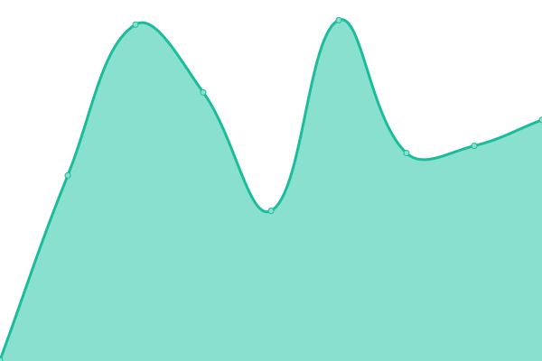
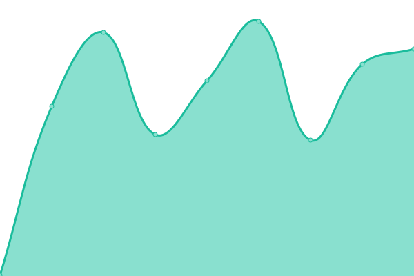

# [📈 Live Status](https://status.dataimpact.ing): <!--live status--> **🟩 All systems operational**

This repository contains the open-source uptime monitor and status page for [데이터임팩트](https://dataimpact.ing), powered by [Upptime](https://github.com/upptime/upptime).

With [Upptime](https://upptime.js.org), you can get your own unlimited and free uptime monitor and status page, powered entirely by a GitHub repository. We use [Issues](https://github.com/DATAIMPACTING/status/issues) as incident reports, [Actions](https://github.com/DATAIMPACTING/status/actions) as uptime monitors, and [Pages](https://status.dataimpact.ing) for the status page.

<!--start: status pages-->
<!-- This summary is generated by Upptime (https://github.com/upptime/upptime) -->
<!-- Do not edit this manually, your changes will be overwritten -->
<!-- prettier-ignore -->
| URL | Status | History | Response Time | Uptime |
| --- | ------ | ------- | ------------- | ------ |
|  [update.dataimpact.ing](https://update.dataimpact.ing/) | 🟩 Up | [update-dataimpact-ing.yml](https://github.com/DATAIMPACTING/status/commits/HEAD/history/update-dataimpact-ing.yml) | 

 688ms
     
 | 

<a href="https://status.dataimpact.ing/history/update-dataimpact-ing">100.00%</a>
    

|  [brand.dataimpact.ing](https://brand.dataimpact.ing/) | 🟩 Up | [brand-dataimpact-ing.yml](https://github.com/DATAIMPACTING/status/commits/HEAD/history/brand-dataimpact-ing.yml) | 

 234ms
     
 | 

<a href="https://status.dataimpact.ing/history/brand-dataimpact-ing">100.00%</a>
    

|  [gallery.dataimpact.ing](https://gallery.dataimpact.ing/) | 🟩 Up | [gallery-dataimpact-ing.yml](https://github.com/DATAIMPACTING/status/commits/HEAD/history/gallery-dataimpact-ing.yml) | 

 169ms
     
 | 

<a href="https://status.dataimpact.ing/history/gallery-dataimpact-ing">100.00%</a>
    

|  [go.dataimpact.ing](https://go.dataimpact.ing/) | 🟩 Up | [go-dataimpact-ing.yml](https://github.com/DATAIMPACTING/status/commits/HEAD/history/go-dataimpact-ing.yml) | 

 298ms
     
 | 

<a href="https://status.dataimpact.ing/history/go-dataimpact-ing">100.00%</a>
    

|  [share.dataimpact.ing](https://share.dataimpact.ing/) | 🟩 Up | [share-dataimpact-ing.yml](https://github.com/DATAIMPACTING/status/commits/HEAD/history/share-dataimpact-ing.yml) | 

 277ms
     
 | 

<a href="https://status.dataimpact.ing/history/share-dataimpact-ing">100.00%</a>
    

<!--end: status pages-->

[**Visit our status website →**](https://status.dataimpact.ing)

## 📄 License

- Powered by: [Upptime](https://github.com/upptime/upptime)
- Code: [MIT](./LICENSE) © [Anand Chowdhary](https://anandchowdhary.com), supported by [Pabio](https://pabio.com)
- Data in the `./history` directory: [Open Database License](https://opendatacommons.org/licenses/odbl/1-0/)
